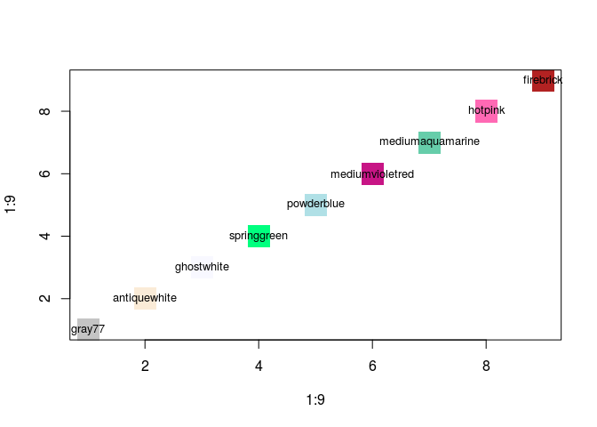

Домашнее задание 1
================
Алла Тамбовцева

Формат сдачи
------------

*Срок сдачи:*

12 ноября 2017, 22:00

*Формат сдачи:*

Студенту необходимо выполнить задание из части 1, а также на выбор выполнить задачи базового или продвинутого блока из части 2. Результат выполнения домашнего задания 1: файл с расширением `.Rmd` (часть 1) и файл с расширением `.R`(часть 2). Эти два файла нужно загрузить по [ссылке](https://www.dropbox.com/request/eb9q9yU3vGDKGDwuygoo). 

Часть 1
-------

*Эта часть задания является обязательной для всех, вне зависимости от того, задачи какого блока (базового или продвинутого) Вы будете выполнять далее.*

**Задание**

1.  Создать файл `hw1-rmd-surname.Rmd`, где surname -- Ваша фамилия латиницей.
2.  Воспроизвести файл, опубликованный по [ссылке](http://rpubs.com/AllaT/rmd-replic3): набрать в созданном файле `hw1-rmd-surname.Rmd` текст с соответствующей разметкой, добавить необходимый код (см.ниже) и график.
3.  Сохранить изменения в Rmd-файле, "связать" html-файл. Скомпилированный html-файл должен выглядеть так же, как и файл, предложенный для репликации.

Код для графика:

``` r
freqs <- c(10, 4, 1) # частоты
lvls <- c("Начальный", "Средний", "Продвинутый") # уровни
colors <- c("royalblue", "yellow", "red") # цвета для диаграммы
percs <- round(freqs / sum(freqs) * 100, 2) # относительные частоты (в процентах)
labels <- paste(lvls, percs) # склеить уровни и проценты - для подписей к диаграмме
labels_fin <- paste(labels,"%", sep = "") # добавить знак % к подписям
pie(freqs, labels = labels_fin, col = colors, main = "Уровень владения R") 
```

Часть 2
-------

### Базовый блок

Скачайте с GitHub файл `hw1-rcode.R`, переименуйте его `hw1-rcode-surname.R`, где `surname` -- Ваша фамилия латиницей. Откройте этот файл в R -- в него Вы будете вписывать код для задач.

**Задача 1**

Посчитайте в R:

-   (5 ⋅ 6) <sup>3</sup>
-   *log*(1000) + *log*<sub>3</sub>(81)
-   3<sup>5</sup> / 2<sup>6</sup> ⋅ *e*<sup>-3</sup>

**Задача 2**

Два события *A* и *B* являются независимыми, если выполняется условие *P*(*A* ∩ *B*)=*P*(*A*)⋅*P*(*B*). Вероятности событий заданы следующим образом:

``` r
pA <- 0.6 # A
pB <- 0.3 # B
pAB <- 0.25 # пересечение A и B
```

Проверьте с помощью R, являются ли события *A* и *B* независимыми.

*Ваш код должен работать для любых pA, pB и pAB, т.е. если мы присвоим этим переменным другие значения, код будет корректно проверять независимость событий *A* и *B* *.

**Задача 3**

Известно, что дискретная случайная величина *X* принимает значения 0, 1, 2, 8 с соответствующими вероятностями: 0.5, 0.3, 0.1, 0.1. Сохраните значения случайной величины в вектор `x`, а вероятности -- в вектор `p`. Найдите математическое ожидание и дисперсию случайной величины *X*.

*Напоминание.* Математическое ожидание -- ожидаемое среднее значение случайной величины -- вычисляется следующим образом:

&space;=\sum\limits_{i=1}^{n}x_ip_i).

Другими словами, перемножаем значения и соответствующие им вероятности, а потом все суммируем).

Дисперсия -- показатель разброса значений случайной величины относительно ожидаемого среднего значения -- вычисляется следующим образом:

&space;=&space;E(X^2)&space;-&space;[E(X)]^2).

*Подсказка.* Для вычислений помимо обычных арифметических операций понадобится функция `sum()`.

**Задача 4**

Число действительных бюллетеней на избирательных участках некоторой территориальной избирательной комиссии задается вектором `valid_votes`, а число недействительных бюллетеней -- вектором `invalid_votes`. Общее число зарегистрированных избирателей задается вектором `voters`.

``` r
valid_votes <- c(25, 8, 12, 18, 25, 32, 10, 17, 22, 17)
invalid_votes <- c(1, 0, 4, 3, 9, 2, 0, 5, 1, 0)
voters <- c(50, 75, 62, 54, 98, 55, 72, 80, 44, 48)
```

Создайте вектор `turnout`, который содержит значения явки (в процентах) на избирательных участках.

*Напоминание.* Явка определяется как доля суммы действительных и недействительных бюллетеней от общего числа зарегистрированных избирателей.

Создайте вектор `turnout_round`, который содержит значения явки (в процентах), округленные до третьего знака после запятой.

**Задача 5**

Вектор `ages` представляет собой набор значений возраста респондентов мужского пола, принимавших участие в опросе.

``` r
ages <- c(23, 18, 19, 33, 36, 27, 68, 62, 78, 45, 42, 38, 55, 16, 14, 17, 92)
```

Выберите из вектора `ages` значения, которые соответствуют трудоспособному возрасту (в России для мужчин -- с 16 до 59 лет включительно), и сохраните их в вектор `work_age`. Сколько людей такого возраста среди наших респондентов?

Выберите из вектора `ages` значения, которые соответствуют возрасту, младше трудоспособного (в России -- менее 16 лет), и сохраните их в вектор `young_age`. Сколько людей такого возраста среди наших респондентов?

**Задача 6**

В R много интересных названий цветов. Вектор `COLORS` -- набор названий некоторых из них.

``` r
COLORS <- c("gray77", "antiquewhite", "ghostwhite", 
          "springgreen", "powderblue", "mediumvioletred", 
          "mediumaquamarine", "hotpink", "firebrick")
```

* Какой индекс в `COLORS` имеет цвет "ghostwhite"?

* Выведите на экран третий элемент вектора `COLORS`.

*Дополнение.* Можете посмотреть, что это были за цвета: 


### Продвинутый блок

**Задача 1**

Известно, что коэффициент корреляции всегда лежит в интервале [-1; 1]. Если не помните про коэффициенты корреляции см. [здесь](https://ru.wikipedia.org/wiki/%D0%9A%D0%BE%D1%80%D1%80%D0%B5%D0%BB%D1%8F%D1%86%D0%B8%D1%8F).

Напишите код, который бы проверял, есть ли в векторе, состоящем из коэффициентов корреляций, недопустимые значения. Если есть, то код должен выдавать TRUE, если нет, то FALSE.

**Задача 2**

Напишите функцию `check_corr`, которая принимает на вход вектор корреляций любой длины, отличной от 0, и ничего не возвращает. Если в векторе все значения допустимые, то она ничего не выводит на экран, если есть хотя бы одно недопустимое, выводит на экран сообщение “The vector of correlations contains inappropriate values”.

**Подсказка:** посмотрите документацию (help) по функции `all`. 

**Задача 3**

*Задача классификации в машинном обучении.*

Есть данные: набор объектов, обладающих некоторыми характеристиками, про которые известно, к каким классам они относятся. Задача: на основе имеющихся данных создать классификатор (алгоритм, модель), который сможет отнести произвольный объект к определенному классу, опираясь на характеристики этого объекта.

Например, нас интересует, каким пользователям можно рекомендовать фильм X. У нас есть база данных по 10000 пользователей, которая содержит следующую информацию: пол пользователя, какие жанры фильмов он предпочитает, сколько фильмов такого же жанра как и X он посмотрел, смотрел ли фильмы с теми же актерами в главных ролях, и, наконец, отметил ли он фильм X как понравившийся или нет. Выбираем подходящий нам метод классификации и на основе имеющихся данных обучаем классификатор, который будет определять, понравится ли фильм X пользователю или нет (1 — понравится, 0 — не понравится). В результате на вход готовому классификатору мы сможем подать характеристики нового пользователя (женщина, предпочитает комедии, смотрела 2 фильма такого же жанра, что и X, не смотрела фильмов с теми же актерами в главных ролях), а классификатор выдаст нам метку 0 — фильм ей не понравится, рекомендовать его не стоит.

*Оценка качества классификации.*

Для оценки качества классификации в машинном обучении используются два важных показателя: точность (precision) и полнота (recall). В случае бинарной классификации (когда необходимо отнести объекты к одному из двух классов, условно «положительному» (1) или «отрицательному» (0), точность можно определить как долю объектов, которые действительно являются положительными, среди тех объектов, которые классификатор отнес к положительному классу, а полноту — как долю объектов, которые классификатор отнес к положительному классу, среди тех объектов, которые действительно являются положительными.

Группа исследователей, занимающихся анализом тональности, разработала свой метод классификации отзывов о фильмах — получила классификатор, который позволяет определить, является ли отзыв о фильме положительным или отрицательным (нейтральные отзывы не рассматриваются). Чтобы оценить качество метода классификации, исследователи взяли 1000 отзывов о фильмах, о которых известно, являются ли они положительными или отрицательными (метки присваивались экспертом), которые не были задействованы при обучении классификатора, определили их тональность с помощью созданного классификатора и проверили, насколько метки, присвоенные классификатором совпадают с метками, присвоенными экспертом.

Даны векторы с метками, присвоенными классификатором (alg) и экспертами (exp).

```{r}
set.seed(1234) # для воспроизводимости результатов
labels_alg <- sample(seq(0, 1), 1000, replace = TRUE)
labels_exp <- sample(seq(0, 1), 1000, replace = TRUE)
```

Пользуясь определениями и векторами с метками, посчитайте точность, полноту и [F-меру](http://bazhenov.me/blog/2012/07/21/classification-performance-evaluation.html) для оценки работы этого алгоритма. 

**Задача 4**

Пользуясь пояснениями из задачи 3, напишите функцию, которая принимает на вход два вектора - метки, присвоенные экспертом и метки, присвоенные классификатором, и 

- возвращает таблицу (data.frame) с точностью метода, полнотой метода и F-мерой (именно возвращает, а не просто выводит на экран)

- сохраняет в файл `incorrect_negative.txt` индексы отзывов, которые были неверно помечены классификатором как отрицательные, сохраняет в файл`incorrect_positive.txt` индексы отзывов, которые были неверно помечены классификатором как положительные.