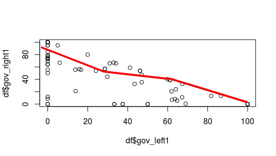

## Распределение количественных показателей и проверка распределения на нормальность 

Иногда в процессе анализа данных мы сталкиваемся с необходимостью определить тип распределения данных. Решить эту задачу непросто: нет такого универсального статистического теста, который позволил бы однозначно определить тип распределения, за исключением случаев, когда оно является нормальным. Но распределение данных можно сравнить с нормальным распределением. Требование нормальности распределения данных лежит в основе некоторых статистических тестов и моделей; плюс, при визуальном сравнении с нормальным распределением удобно отмечать всякие особенности распределения (скошенность, наличие "длинных хвостов" и прочее).

Начнем с визуального анализа. Например, наложим на гистограмму, построенную для показателя, график плотности нормального распределения с соответствующими параметрами. 

*Напоминание 1.* О графике плотности распределения можно думать как о "сглаженной" гистограмме с большим числов столбцов. 

```{r}
set.seed(123) # для воспроизводимости
x <- sample(seq(1, 200), 100) # показатель x
hist(x) # гистограмма x
plot(density(x)) # график плотности x
```

*Напоминание 2.* Нормальное распределение задается двумя параметрами: математическим ожиданием и стандартным отклонением. Математическое ожидание отвечает за среднее значение распределения (значение, относительно которого симметричен график плотности распределения), стандартное отклонение -- за разброс значений вокруг среднего.

```{r}
# add = TRUE - чтобы добавлять графики к уже нарисованным

curve(dnorm(x, mean = 2, sd = 1), xlim = c(-10, 10), col = "green" )
curve(dnorm(x, mean = -1, sd = 1), xlim = c(-10, 10), col = "blue", add = TRUE)
curve(dnorm(x, mean = 2, sd = 3), xlim = c(-10, 10), col = "red", add = TRUE)
```

Теперь попробуем совместить на графике гистограмму и график плотности нормального распределения с соответствующими параметрами. Загрузим базу данных с прошлого занятия.

```{r, message=FALSE}
library(foreign)
df <- read.dta("CPDS.dta")

library(dplyr)
df <- df %>% filter(year >= 2014) # выберем данные 
```

Построим гистограмму для показателя *vturn* (явка на выборы) и наложим на нее график плотности нормального распределения с соответствующими параметрами. Какие параметры считать соответствующими? Среднее значение, равное среднему значению показателя *vturn*, и стандартное отклонение, равное стандартному отклонению *vturn*.

```{r}
# freq = FALSE - обязательно, так как нужны не абсолютные частоты, а вероятности
hist(df$vturn, main = "Histogram of turnout", freq = FALSE, col = "tomato")

# na.rm = TRUE - не учитываем пропуски (NA)
curve(dnorm(x, mean = mean(df$vturn, na.rm = TRUE), 
            sd = sd(df$vturn, na.rm = TRUE)), 
            col = "blue", add = TRUE)
```

Пока кажется, что распределение явки похоже на нормальное. А теперь проверим формально.

Один из статистических критериев, позволяющих проверить нормальность распределения данных, это **критерий Шапиро-Уилка**. С помощью этого критерия проверяется нулевая гипотеза, которая состоит в том, что *данные распределены нормально*.

```{r}
shapiro.test(df$vturn)
```

P-value > 0.05, следовательно, вероятность того, что нулевая гипотеза верна при условии имеющихся данных, не мала. На имеющихся данных на уровне значимости 5% (0.05) нет оснований отвергнуть нулевую гипотезу о том, что данные распределены нормально. Показатель явки имеет нормальное распределение.

## Связь между качественными переменными: таблицы сопряженности и критерий хи-квадрат

С таблицами частот мы уже знакомы. Познакомимся с **таблицами сопряженности** -- таблицами, которые иллюстрируют совместное распределение переменных. Построим таблицу сопряженности (contingency table) для двух признаков: *poco* (принадлежность к пост-коммунистическим странам) и  *gov_party* (тип партийной системы).

```{r}
ctab <- table(df$poco, df$gov_party)
View(ctab)
```

По полученной таблице сопряженности можно определить, например, что число пост-коммунистических стран с гегемонией правых/центристских партий равно 4.

Связь между качественными переменными можно визуализировать с помощью мозаичного графика (mosaic plot). Подробнее о мозаичном графике см. [здесь](https://en.wikipedia.org/wiki/Mosaic_plot) и [здесь](https://cran.r-project.org/web/packages/vcdExtra/vignettes/vcd-tutorial.pdf). Для этого потребуется библиотека *vcd*.

```{r, message=FALSE}
# install.packages("vcd")
library(vcd)
mosaic(poco ~ gov_party, data = df)
```

Перекрывающие друг друга названия категорий по оси x все портят, но идея понятна: с помощью мозаичного графика мы можем визуализировать таблицу сопряженности. Темно-серый цвет соответствует пост-коммунистическим странам, светло-серый -- всем остальным. 
Разбивка на пять блоков по горизонтали -- разбивка по значениям переменной *gov_party* (гегемония правых/центристских партий, доминирование левых партий и прочие).

Чтобы все совсем стало понятно, поправим подписи по оси x.

```{r}
ang_labels <-  c(0, 0, 0, 0, 0) # углы 
pos_labels = rep("right", 5) # позиции названий
args = list(set_varnames = c(poco = "", gov_party = "")) # убираем подписи к осям
mosaic(poco ~ gov_party, data = df, rot_labels = ang_labels, just_labels = pos_labels,
       labeling_args = args)
```

Проблему длинных подписей можно решать по-разному. Мы пока на время воспользуемся простым, но не самым красивым: добавим аргумент `abbreviate = TRUE`, и все подписи будут сокращены по первым буквам:

```{r}
mosaic(poco ~ gov_party, data = df, rot_labels = ang_labels, just_labels = pos_labels,
       labeling_args = args, abbreviate = TRUE)
```

А теперь проверим формально, есть ли связь между этими признаками (принадлежность к пост-коммунистическим странам и тип партийной системы). Воспользуемся критерием хи-квадрат. Нулевая гипотеза: *признаки не связаны (независимы)*.

```{r, message = FALSE}
chisq.test(table(df$poco, df$gov_party))
```

P-value > 0.05, следовательно, вероятность того, что нулевая гипотеза верна при условии имеющихся данных, не мала. На имеющихся данных на уровне значимости 5% (0.05) нет оснований отвергнуть нулевую гипотезу о том, что признаки независимы. Тип партийной системы и принадлежность к пост-коммунистическим странам не связаны.

*Замечание.* R выдал предупреждение `Chi-squared approximation may be incorrect`. (Пояснение, возможно, будет понятно не всем, но его можно смело пропустить и посмотреть, как решается эта проблема). При расчете ожидаемых частот для расчета наблюдаемого значения статистики хи-квадрат получилось, что некоторые ожидаемые частоты в ячейках таблицы сопряженности меньше 5, и таких ячеек много. В такой ситуации p-value не может быть посчитан точно. Для решения проблемы нужно дописать аргумент `simulate.p.value = TRUE`, тогда R будет считать p-value по-другому, используя симуляции (см. `help` и документацию).

## Связь между количественными переменными: диаграммы рассеяния и коэффициенты корреляции

*Напоминание про корреляции.* Коэффициент корреляции К.Пирсона -- показатель линейной связи между двумя переменными, измеренными в количественной шкале. Коэффициент корреляции принимает значения от -1 до 1. Отрицательные значения коэффициента корреляции свидетельствуют об обратной связи между переменными (с ростом значений одной переменной значения другой переменной уменьшаются), положительные значения коэффициента корреляции -- о прямой связи между переменными (с ростом значений одной переменной значения другой переменной увеличиваются). Если коэффициент корреляции Пирсона между переменными равен 0, это не всегда означает, что связи между ними нет -- связь между ними может просто быть нелинейной (например, квадратичной). Коэффициент корреляции показывает только связь между переменными, а не зависимость (Y зависит от X) и не влияние (X влияет на Y).

Коэффициент корреляции Ч.Спирмена также используется для измерения связи между двумя переменными, измеренными в количественной шкале, преимущественно в порядковой (ординальной). Коэффициент корреляции Спирмена, в отличие от коэффициента Пирсона, является устойчивым к наличию нетипичных значений.

Связи между количественными переменными можно представить в виде корреляционной матрицы. Корреляционная матрица всегда симметрична (коэффициент корреляции между переменными X и Y равен коэффициенту корреляции между переменными Y и X), и на главной диагонали такой матрицы стоят 1 (корреляция переменной самой с собой равна 1).

**Диаграммы рассеяния (scatterplots)**

Допустим, мы хотим посмотреть на связь между переменными gov_left1 и gov_right1. Построим диаграмму рассеяния (scatterplot).

```{r}
plot(df$gov_left1, df$gov_right1)
```

По диаграмме рассеяния видно, что связь между переменными обратная (чем больше x, тем меньше y) и, скорее всего, сильная. 

Как можно заметить, особой красотой этот график не отличается. График скучный. Что мы можем сделать? Во-первых, подписать оси.

```{r}
plot(df$gov_left1, df$gov_right1, 
     xlab = "Left parties (% of total)", ylab = "Right parties (% of total)")
```

Во-вторых, мы можем добавить цвета, причем вполне содержательно. Допустим, мы хотим разделить страны на пост-коммунистические и не пост-коммунистические и отразить это на графике. То есть, точки, соответствующие пост-коммунистическим странам и точки, соответствующие всем остальным странам будут отличаться по цвету.

```{r}
str(df$poco) # проверим, какие значения принимает poco

colors <- c("blue", "red")[df$poco] # устанавливаем цвета по группирующей переменной

plot(df$gov_left1, df$gov_right1, 
     xlab = "Left parties (% of total)", 
     ylab = "Right parties (% of total)",
     col = colors, lwd = 2)

# lwd - толщина линии, в нашем случае толщина окружностей для точек
```

По умолчанию R использует "пустые" точки. Но тип точек можно менять, добавляя аргумент `pch`. Список маркеров для точек см. [здесь](http://www.cookbook-r.com/Graphs/Shapes_and_line_types/).  

**Матрица диаграмм рассеяния (scatterplot matrix)**

Иногда в ходе предварительного анализа бывает нужно посмотреть на связь “всего со всем”. Для этого удобно использовать матрицу диаграмм рассеяния. 

Построим диаграммы рассеяния для процентов голосов за разные партии.

```{r}
pairs(df[10:12], col = colors) # выбираем столбцы 10-12
```

На пересечении названий переменных находятся диаграммы рассеяния, соответствующие парам показателей. 

А теперь проиллюстрируем то же самое, но более красочно. Для этого потребуется библиотека *car*.

```{r, message=FALSE}
# install.packages("car")
library(car)

# diagonal - что стоит на диагонали
# smooth = FALSE - обычная регрессия, 
# smooth = TRUE - loess регрессия

scatterplotMatrix(df[10:12], diagonal = "histogram", smooth = FALSE)
```

На диагональ этой матрицы диаграмм мы можем добавлять разные графики, отражающие распределение показателей, например, гистограммы или ящики с усами. На сами диаграммы рассеяния добавляется регрессионная прямая (прямая вида y = kx+b, при k < 0 наклон прямой отрицательный, связь между x и y обратная, при k > 0 наклон прямой положительный, связь между x и y прямая). Можно также добавить кривую взвешенной регрессии (*loess regression* от *locally weigthed regression*). Логика ее построения (в очень упрощенном виде) такая: 

* все значения x разбиваем на много маленьких интервалов
* на каждом интервале строим регрессионную прямую

```{r echo=FALSE, out.width='50%'}

```

* "сглаживаем" получившуюся ломаную линию, чтобы получить гладкую кривую

Наведем красоту на графике выше:

```{r}
# создадим вектор с названиями переменных

labs <- c("Right", "Center", "Left")

# reg.line = FALSE - нет регрессионной прямой, оставим только smooth (loess curve)
# var.labels - названия переменных на диагонали
# cex.labels - размер шрифта для labels
# main - название графика

scatterplotMatrix(df[10:12], diagonal = "histogram", smooth = TRUE, 
                  reg.line = FALSE, 
                  var.labels = labs, 
                  cex.labels = 1.3, 
                  main = "Correlations of parties' share")
```

Еще один вариант симпатичного графика для корреляций - разноцветный график, созданный с помощью пакета *gclus*.

```{r, message=FALSE}
library(gclus)

# получим вектор коэффициентов корреляции (по модулю)
coeffs <- abs(cor(df[10:12])) 

# зададим цвета (автоматическое разбиение по вектору коэффициентов)
colors <- dmat.color(coeffs) 

# отсортируем так, чтобы графики, где связь переменных наибольшая,
# были ближе к диагонали

order <- order.single(coeffs)

# строим сам график
# gap - расстояние между графиками в матрице

cpairs(df[10:12], order, panel.colors = colors, gap = .5,
       main = "Correlations of parties' shares" )
```

**Корреляционный анализ**

Для начала посмотрим на коэффициент корреляции между какими-нибудь двумя переменными:

```{r}
cor(df$gov_left1, df$gov_right1)
```

Если бы в одной из переменных были пропущенные значения (NA), коэффициент корреляции бы не рассчитался. Тут можно действовать по аналогии с расчетом среднего значения:

```{r}
cor(df$gov_left1, df$gov_right1, use = "complete.obs") # использовать все, кроме NA (complete observations)
```

Как известно, существуют разные коэффициенты корреляции. Самые распространенные - линейный коэффициент корреляции Пирсона, коэффициент ранговой корреляции Спирмена и коэффициент ранговой корреляции Кендалла. По умолчанию считается коэффициент Пирсона, остальные можно получить, прописав дополнительный аргумент:

```{r}
cor(df$gov_left1, df$gov_right1, method = "spearman") # коэфф. Спирмена
```

Проверить значимость коэффициента корреляции -- проверить нулевую гипотезу о том, что истинный коэффициент корреляции равен 0.  

```{r}
corr <- cor.test(df$gov_left1, df$gov_right1)
corr
```

В выдаче R мы видим две важные вещи: значение коэффициента корреляции (sample estimates) и pvalue. В нашем случае pvalue < 0.05, следовательно, на 5% уровне значимости есть основания отвергнуть нулевую гипотезу о равенстве коэффициента корреляции нулю. Раз эту гипотезу отвергаем, считаем, что коэффициент корреляции не 0, а следовательно, связь между процентом левых и правых партий действительно есть.

Выдача R представляет собой список (list):
```{r}
str(corr)
```

А значит, из него можно вызывать отдельные элементы.

```{r}
coeff <- corr$estimate # коэффициент
pvalue <- corr$p.value # p-value
coeff; pvalue
```

Если хотим посмотреть на корреляцию “всего со всем”, можем указать столбцы в базе (переменные) и получить корреляционную матрицу:

```{r}
cor(df[10:12])
```

Для того, чтобы получить корреляционную матрицу и значимость коэффициентов в ней, нужно постараться. Загрузим библиотеку *Hmisc*.

```{r, message=FALSE}
# install.packages("Hmisc")
library(Hmisc)

# Внимание: функция привередничает - требует матрицу, а не просто столбцы из базы

rcorr(as.matrix(df[10:12])) 
```
Но то, что мы увидели, немного не похоже на то, что хотелось бы показать другим. Единой таблички с коэффициентами и значимостью нет. Действительно, в R есть некоторые проблемы с корреляционными матрицами. 

Воспользуемся уже написанной функцией, доступной по [ссылке](http://www.sthda.com/english/wiki/elegant-correlation-table-using-xtable-r-package), и немного модифицируем ее. Чтобы воспользоваться этой функцией, помимо уже установленного нами пакета *Hmisc* потребуется библиотека *xtable*. Как и *stargazer* она используется для выгрузки выдач R в html или LaTeX.
```{r}
#install.packages("xtable")
```

Скопируем код для функции с сайта в R-файл (New RScript) и назовем его `correlation.R`. Модифицируем код: в качестве аргумента функции corstars добавим file (про написание собственных функций поговорим позже).
```{r, eval = FALSE}
corstars <-function(x, method=c("pearson", "spearman"), removeTriangle=c("upper", "lower"), result=c("none", "html", "latex"), file)
```

А также допишем в строки 46 и 47 `file = file`:
```{r, eval = FALSE}
if(result[1]=="html") print(xtable(Rnew), type = "html", file = file)
    else print(xtable(Rnew), type="latex", file = file)
```

Это нужно для того, чтобы R не просто выводил результат в консоль, но и сохранял код для таблички в отдельный файл. 

Добавим также строку `require(xtable)`, например, после `require(Hmisc)`, иначе R не поймет, откуда брать функцию `xtable`. Теперь сохраним все изменения в файле `correlation.R` и загрузим его сюда:

```{r}
source("correlation.R")
```

Теперь R знает, что из этого файла можно брать функции, и не будет ругаться, если встретит незнакомое (не встроенное в базовые библиотеки) название. 

Финальный аккорд:

```{r, message=FALSE}
# сохраняем результат в файл corrtable.htm - можем открыть через браузер иди Word

corstars(x = df[10:12], method = "pearson", removeTriangle = "upper", 
         result = "html", file = "corrtable.htm")
```


