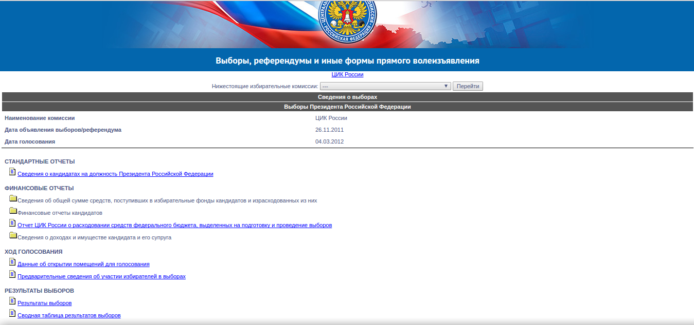

Семинар 5. Базы данных и dplyr.
================
Алла Тамбовцева
15 декабря 2017 г

На этом семинаре мы будем работать с базой данных, содержащей результаты выборов президента 2012 года. Для этого зайдем на сайт ["Голоса"](https://www.golosinfo.org/), в раздел "Календарь выборов" (см. колонку справа). Выберем федеральный уровень выборов, применим фильтр и в списке выборов найдем нужные. На всякий случай, [ссылка](http://els.golosinfo.org/ru/elections/47130). Находим строчку "Результаты выборов 47130-8314.zip", скачиваем архив (там один файл) и распаковываем.

1.  Загрузите базу данных с расширением `.csv` и сохраните ее как df (не забудьте про кодировку). Посмотрите на нее.
2.  Зайдите на [сайт](http://www.cikrf.ru/) Центральной избирательной комиссии, откройте раздел "Информация о выборах и референдумах", найдите нужные выборы. Страница с результатами выглядит так:  Выберите сводную таблицу результатов выборов, посмотрите, как называются строки в таблице. Соотнесите названия строк в таблице на сайте ЦИК и названия столбцов в базе "Голоса". Оставьте в базе данных столбцы с названиями региона, ТИКа (района) и УИКа, а также столбцы, которые позволят посчитать явку и процент голосов за каждого из кандидатов (используя функции dplyr). 
3. Переименуте столбцы с X-ами в названии так, чтобы названия переменных были содержательными (total, valid, invalid, и.т.д.)
4. Добавьте в базу данных столбец turnout со значениями явки (пока не в процентах, а просто число недействительных и действительных бюллетеней).
5. Агрегируйте данные по регионам: создате базу aggr_reg, в которой хранятся все те же показатели, но суммированные по регионам.
6. Создайте в базе aggr_reg показатель turnout_perc, который соответствует явке (в %) по регионам. Создайте в базе aggr_reg переменные, соответствующие проценту голосов, полученных кандидатами в регионах (процент считается от явки).

